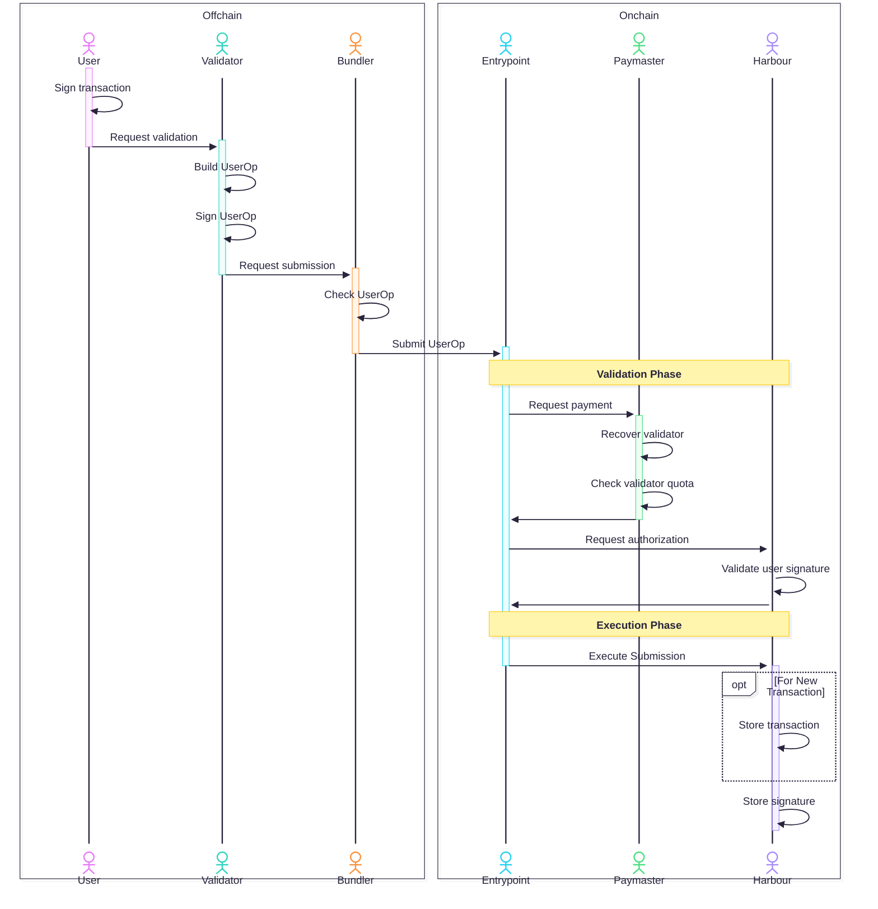

# Architecture

Harbour consists of an onchain contract that is responsible for the storage of signatues and transaction information. The contract is append only and information that has been submitted once cannot be updated or deleted.

The simplest way to interact with the Harbour contracts is to directly call the corresponding methods. Another alternative is to relay the interactions to Harbour. This is possible as Harbour does not depend on `msg.sender` or `tx.origin` for any validation.

To make this more accessible Harbour has built-in support for [ERC-4337](https://ercs.ethereum.org/ERCS/erc-4337). The Harbour contract acts as the account and allows interaction by validating the signatures provided.

It is important to note that there are some limitation this, namely that it is required to use a paymaster. The [`SafeHarbourPaymaster`](./validator_network.md#paymaster) can be used for this. This paymaster will sponsor the interactions with Harbour, as long as a "validator" with sufficient quota (similar to stake) authorizes the interaction. 

## Relaying with direct validator usage

To submit a transaction using ERC-4337 and a validator it is necessary that the validator provides a signature for the storage.

The responsibilities of the signers are to sign the Safe transaction and transmit it to the validator. While the responsibility of the validator is to ensure that it gets stored, so that it can be consumed by other participants.

The following sequence diagram outlines the interaction between the different actors and also clearly shows what happens offchain and what happens onchain.

## Relaying with validators via Waku

Maintaining a direct connection to the validator is contradictory as the purpose of Harbour is to reduce single points of failure and thrive for decentralization. While it is possible to easily switch to another validator this still requires management of a direct interaction with a validator. Therefore an alternative communication channel has been implemented using [Waku](https://github.com/waku-org/waku).

In simplified terms the signer broadcasts its signature to all validators via Waku. The validators then submit the information to Harbour for storage.

More information to this can be found in the [validator network](validator_network.md) documentation.